# GitLab CI/CD — Comprehensive Training Notes

> **Complete reference guide** covering GitLab from first principles through production-grade pipelines.
> All diagrams render natively on GitHub. All `.gitlab-ci.yml` examples are copy-paste ready.

---

## Table of Contents

| # | Section |
|---|---------|
| [01](#01--introduction-to-gitlab) | Introduction to GitLab |
| [02](#02--core-components--code-build-deploy) | Core Components — Code, Build, Deploy |
| [03](#03--gitlab-runners) | GitLab Runners |
| [04](#04--basic-pipeline--your-first-gitlab-ciyml) | Basic Pipeline — Your First `.gitlab-ci.yml` |
| [05](#05--jobs-deep-dive) | Jobs Deep Dive — build, test, deploy |
| [06](#06--cicd-variables) | CI/CD Variables |
| [07](#07--artifacts-and-cache) | Artifacts and Cache |
| [08](#08--terraform-gitlab-pipeline) | Terraform GitLab Pipeline |
| [09](#09--java-gitlab-pipeline) | Java GitLab Pipeline — Maven · Nexus · SonarQube |
| [10](#10--include-composing-pipelines-from-reusable-templates) | include: — Composing Pipelines from Reusable Templates |

---

## 01 — Introduction to GitLab

GitLab is a **complete DevOps platform** — a single application covering the entire software development lifecycle: planning, source code management, CI/CD pipelines, security scanning, infrastructure management, and monitoring.

> **Key distinction:** GitHub is source control with CI as an add-on. GitLab was designed from day one as a unified DevOps platform — one application, one interface, one place to audit.

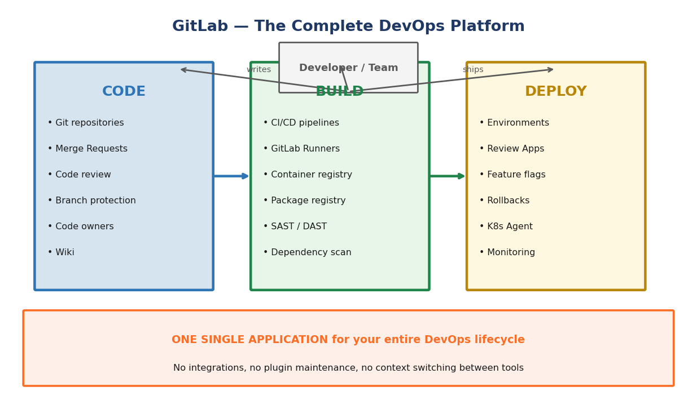

### GitLab vs GitHub vs Jenkins

| Feature | GitLab | GitHub | Jenkins |
|---------|--------|--------|---------|
| Source control | ✅ Full Git hosting | ✅ Full Git hosting | ❌ CI only |
| Built-in CI/CD | ✅ Native, zero config | ⚠️ Actions (add-on) | ✅ Core purpose |
| Container registry | ✅ Built-in | ✅ GitHub Packages | ⚠️ Plugin |
| Package registry | ✅ Maven, npm, PyPI, Helm | ✅ GitHub Packages | ⚠️ Plugin |
| Terraform state | ✅ Built-in, free | ❌ | ❌ |
| Security scanning | ✅ SAST, DAST, dep scan | ⚠️ Advanced Security (paid) | ⚠️ Plugin |
| Self-hosted | ✅ CE (free) / EE (paid) | ✅ GitHub Enterprise | ✅ |
| SaaS | ✅ gitlab.com | ✅ github.com | ❌ |

### Key Terminology

| Term | Meaning |
|------|---------|
| **Pipeline** | The full set of stages and jobs triggered by a git event |
| **Stage** | A group of jobs that run in parallel at the same time |
| **Job** | A single unit of work (shell commands) executed by a Runner |
| **Runner** | An agent process that picks up and executes jobs |
| **Artifact** | Files produced by a job, passed to later jobs or downloaded |
| **Environment** | A named deployment target (dev, staging, production) |
| **Merge Request** | A proposal to merge one branch into another, with review |

---

## 02 — Core Components — Code, Build, Deploy

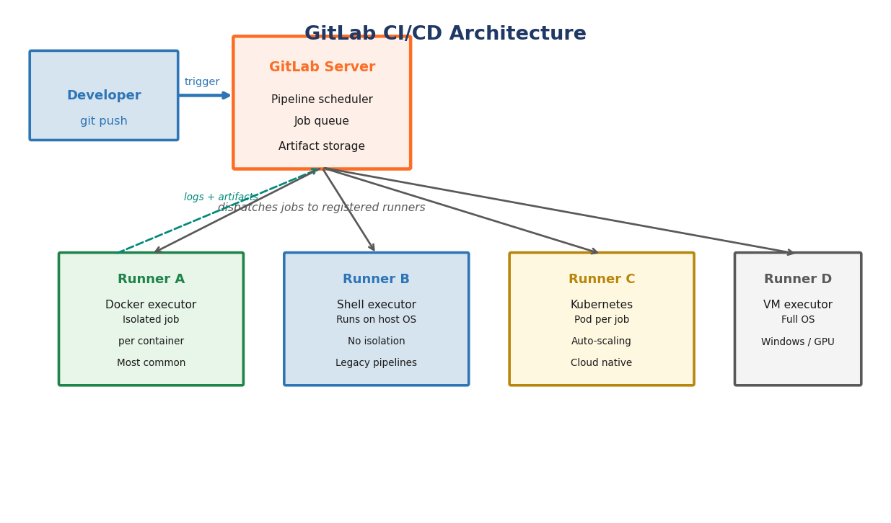

### Code — Source Code Management

Everything around managing source code safely in a team:

- **Protected branches** — prevent direct pushes to `main`; require Merge Request review
- **Merge Requests** — the formal code review process with inline comments and approval rules
- **Code Owners** — `CODEOWNERS` file specifying who must approve changes to specific paths
- **Branch strategies** — GitLab Flow, Git Flow, and trunk-based development all supported
- **Wiki & snippets** — integrated documentation alongside the code

### Build — CI/CD Pipelines

Every time code is pushed, GitLab reads `.gitlab-ci.yml` from the repository root and creates a pipeline:

- **Stages** execute in sequence — all jobs in a stage must pass before the next stage starts
- **Jobs within a stage** run in parallel across available Runners
- **Each job** gets a clean execution environment (fresh container with Docker executor)
- **Failure** in any required job stops the pipeline and reports failure

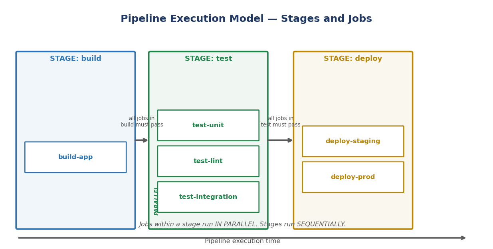

> **Jobs within a stage run in parallel. Stages run sequentially.**

### Deploy — Releasing to Environments

- **Environments** — named deployment targets (dev / staging / production) with full deployment history and rollback
- **Review Apps** — temporary live deployments automatically created per Merge Request
- **Manual gates** — `when: manual` requires a human to click Play before the job runs
- **Rollbacks** — one-click rollback to the previous successful deployment from the Environments page

### The Pipeline Execution Model

```
Push to GitLab
      │
      ▼
┌─────────────────────────────────────────┐
│               Pipeline                  │
│  ┌─────────┐  ┌──────────┐  ┌────────┐ │
│  │  build  │→ │   test   │→ │ deploy │ │
│  │         │  │ unit     │  │        │ │
│  │build-app│  │ lint   ← parallel    │ │
│  │         │  │ integration│  │       │ │
│  └─────────┘  └──────────┘  └────────┘ │
└─────────────────────────────────────────┘
```

#### Key Takeaways
- A pipeline is triggered by: push, merge, tag, schedule, or API call
- Stages run **sequentially** — jobs within a stage run **in parallel**
- A pipeline only advances to the next stage if all required jobs in the current stage passed

---

## 03 — GitLab Runners

A **GitLab Runner** is a lightweight agent process installed on any machine that polls the GitLab server for available jobs. When assigned a job, it executes the commands, streams logs back in real time, and uploads artifacts.

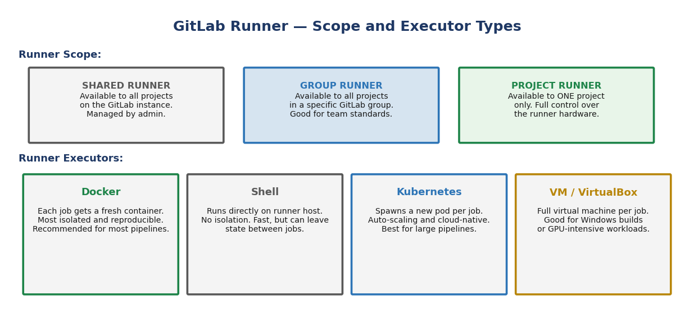

### Runner Scope

| Scope | Where Registered | Available To | Best For |
|-------|-----------------|-------------|----------|
| **Shared runners** | GitLab instance level | All projects on the instance | Small teams, GitLab.com users |
| **Group runners** | A GitLab group | All projects in that group | Team-standard runner configuration |
| **Project runners** | A specific project | That project only | Projects with special hardware needs |

### Runner Executors

| Executor | Isolation | Speed | Best For |
|----------|-----------|-------|----------|
| **Docker** | Each job = fresh container | Fast | Most CI/CD — **recommended default** |
| **Shell** | Runs on host OS | Fastest | Legacy builds, host-level access needed |
| **Kubernetes** | Pod per job, auto-scaling | Variable | Large teams, cloud-native |
| **Docker Machine** | Ephemeral cloud VMs | Slow startup | GitLab.com shared auto-scaling |
| **VirtualBox / VM** | Full VM per job | Slowest | GUI testing, Windows builds |

### Registering a Runner

```bash
# 1. Install GitLab Runner (Debian / Ubuntu)
curl -L https://packages.gitlab.com/install/repositories/runner/gitlab-runner/script.deb.sh | sudo bash
sudo apt-get install gitlab-runner

# 2. Register (interactive — prompts for URL, token, executor)
sudo gitlab-runner register

# 2b. Non-interactive registration (useful for automation)
sudo gitlab-runner register \
  --non-interactive \
  --url https://gitlab.com \
  --registration-token YOUR_TOKEN_FROM_GITLAB_UI \
  --executor docker \
  --docker-image alpine:3.19 \
  --description "My Docker Runner"
```

> **GitLab.com** provides shared runners at no extra cost on all tiers.
> For **self-hosted GitLab**, you must register at least one runner before CI/CD works.
> A **Docker executor** runner is the recommended starting point.

---

## 04 — Basic Pipeline — Your First `.gitlab-ci.yml`

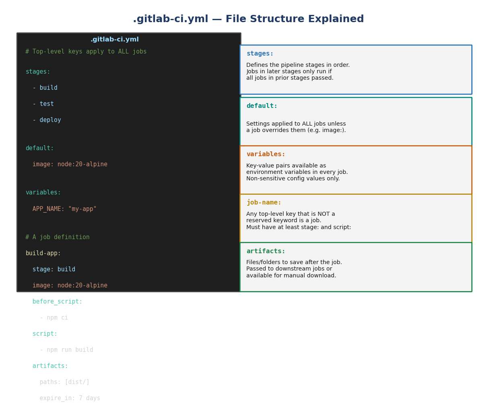

### The File

`.gitlab-ci.yml` lives at the **root of your repository**. GitLab reads it on every push and creates a pipeline from it. It uses YAML syntax.

> ⚠️ The file must be named **exactly** `.gitlab-ci.yml` — including the leading dot.
> YAML is whitespace-sensitive. Use **2-space indentation**. Tabs cause parse errors.

### Reserved Top-Level Keys

| Key | Purpose | Example |
|-----|---------|---------|
| `stages:` | Stage names in execution order | `stages: [build, test, deploy]` |
| `default:` | Settings that apply to all jobs unless overridden | `default: { image: node:20 }` |
| `variables:` | Pipeline-wide variables (non-sensitive only) | `variables: { VERSION: '1.2' }` |
| `include:` | Import other `.yml` files | `include: [shared/templates.yml]` |
| `workflow:` | Control when the entire pipeline runs | `workflow: { rules: [...] }` |

### A Minimal Working Pipeline

```yaml
# .gitlab-ci.yml

stages:
  - build
  - test
  - deploy

default:
  image: alpine:3.19    # Docker image every job runs in (unless overridden)

# ── build stage ──────────────────────────────────────────────────────────────
build-app:
  stage: build
  script:
    - echo "Building application..."
    - mkdir -p dist
    - echo "build output" > dist/app.txt
    - echo "Build ID: $CI_PIPELINE_ID"

# ── test stage ───────────────────────────────────────────────────────────────
test-unit:
  stage: test
  script:
    - echo "Running unit tests..."

test-lint:
  stage: test           # Same stage as test-unit → runs IN PARALLEL
  script:
    - echo "Running linter..."

# ── deploy stage ─────────────────────────────────────────────────────────────
deploy-staging:
  stage: deploy
  script:
    - echo "Deploying commit $CI_COMMIT_SHORT_SHA to staging..."
  environment:
    name: staging
  only:
    - main              # Only runs on the main branch
```

### Every Job Must Have

- `stage:` — which stage it belongs to
- `script:` — at least one command to execute

### A Job Can Also Have

| Key | Purpose |
|-----|---------|
| `image:` | Override the default Docker image for this job |
| `before_script:` | Commands that run before `script:` — setup, installs |
| `after_script:` | Always runs even if `script:` fails — cleanup |
| `artifacts:` | Files to save and pass to downstream jobs |
| `rules:` | Conditions controlling when this job runs |
| `needs:` | Run as soon as specific jobs pass — skip stage order |
| `environment:` | Link this job to a named deployment environment |
| `allow_failure: true` | Job failure won't fail the whole pipeline |
| `cache:` | Store files between pipeline runs |

#### Key Takeaways
- `.gitlab-ci.yml` at the repo root — GitLab reads it on every push
- `stages:` lists stage names in order. Jobs not listed in `stages:` are invalid
- Every job needs at minimum: `stage:` and `script:`
- Jobs in the same stage run **in parallel**. Stages run **sequentially**

---

## 05 — Jobs Deep Dive

### The Build → Test → Deploy Pattern

```
Push to branch
      │
      ▼
  [build]           compile, install deps, produce output artifact
      │
      ▼
  [test-unit]  ─┐
  [test-lint]   ├── all run in PARALLEL (same stage)
  [test-int]   ─┘
      │
      ▼
  [deploy-staging]  auto-deploy on main branch
      │
      ▼
  [deploy-prod]     MANUAL gate — human must click Play
```

### Complete Job Example

```yaml
build:
  stage: build
  image: node:20-alpine           # Override default image for this job only
  before_script:                  # Runs BEFORE script: — setup
    - echo "Installing deps..."
    - npm ci --silent
  script:                         # The actual job work
    - npm run build
    - echo "Built commit $CI_COMMIT_SHORT_SHA"
  after_script:                   # Runs AFTER script: — even if it failed
    - echo "Cleaning up temp files"
  artifacts:
    paths:
      - dist/
    expire_in: 1 hour
  allow_failure: false            # Default — failure fails the pipeline
```

### `rules:` — The Modern Way to Control When Jobs Run

> Use `rules:` (not the older `only:` / `except:`) for all new pipelines.

```yaml
# Only run on main branch
deploy-staging:
  stage: deploy
  script: ./deploy.sh staging
  rules:
    - if: '$CI_COMMIT_BRANCH == "main"'

# Only on tags — and requires human approval
deploy-production:
  stage: deploy
  script: ./deploy.sh production
  rules:
    - if: '$CI_COMMIT_TAG'
      when: manual

# Skip on main, run everywhere else
feature-checks:
  stage: test
  script: ./checks.sh
  rules:
    - if: '$CI_COMMIT_BRANCH == "main"'
      when: never
    - when: always
```

### `needs:` — Skip Stage Ordering for Faster Pipelines

Without `needs:`, a job waits for **every** job in the previous stage.
With `needs:`, it starts as soon as its specific dependency passes.

```yaml
# test-unit starts immediately when build-app passes,
# even if other build-stage jobs are still running
test-unit:
  stage: test
  needs:
    - job: build-app
      artifacts: true    # also download build-app's artifacts
  script: npm test
```

### The Manual Approval Gate Pattern

```yaml
deploy-production:
  stage: deploy
  script:
    - echo "Deploying $CI_COMMIT_TAG to production"
  environment:
    name: production
    url: https://www.example.com
  rules:
    - if: '$CI_COMMIT_TAG'    # only triggered by a git tag push
      when: manual            # appears in UI but must be manually started
      allow_failure: false
```

### `before_script:` vs `after_script:`

```yaml
default:
  before_script:             # Runs for EVERY job (can be overridden per-job)
    - echo "Pipeline: $CI_PIPELINE_ID"

build:
  stage: build
  before_script:             # Overrides the default before_script for THIS job
    - npm ci
  script:
    - npm run build
  after_script:              # Runs after script: regardless of pass/fail
    - rm -rf /tmp/build-cache
```

#### Key Takeaways
- Use `rules:` not `only:` / `except:` for all new pipelines
- `needs:` removes stage ordering for specific dependencies — much faster pipelines
- `when: manual` creates an approval gate — visible but requires a human click
- `allow_failure: true` makes a job's failure non-blocking — pipeline continues
- `after_script:` always runs — use it for cleanup that must happen regardless

---

## 06 — CI/CD Variables

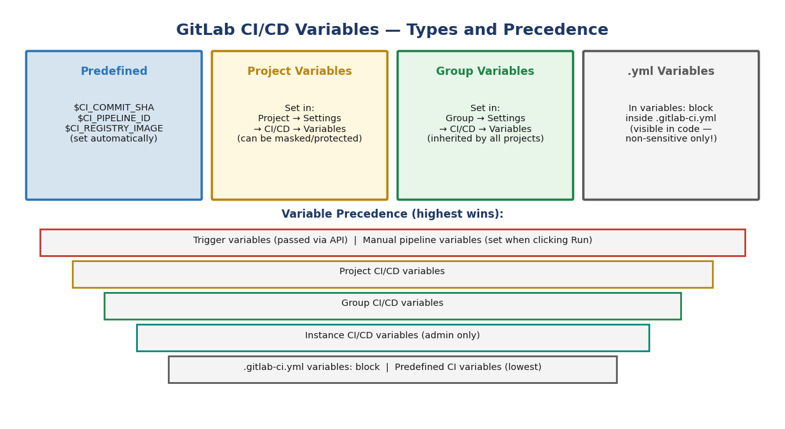

### Types of Variables

| Type | Where Defined | Scope | Use For |
|------|--------------|-------|---------|
| **Predefined** | Built into GitLab — automatic | Every pipeline | Commit info, branch, registry URL |
| **Project variables** | Project → Settings → CI/CD | One project | Project-specific secrets |
| **Group variables** | Group → Settings → CI/CD | All projects in group | Shared team credentials |
| **Inline `.yml`** | `variables:` block in `.gitlab-ci.yml` | That pipeline | Non-sensitive config values |
| **Trigger variables** | Passed via API or pipeline trigger | Triggered pipeline | Cross-project parameterisation |

### Most Useful Predefined Variables

| Variable | Contains | Example Value |
|----------|----------|---------------|
| `$CI_PIPELINE_ID` | Unique pipeline number | `12345678` |
| `$CI_JOB_ID` | Unique job number | `98765432` |
| `$CI_COMMIT_SHA` | Full 40-char commit hash | `a1b2c3d4...` |
| `$CI_COMMIT_SHORT_SHA` | First 8 chars of commit hash | `a1b2c3d4` |
| `$CI_COMMIT_REF_NAME` | Branch or tag name | `main` or `v1.2.0` |
| `$CI_COMMIT_BRANCH` | Branch name (empty for tags) | `feature/login` |
| `$CI_COMMIT_TAG` | Tag name (empty for branches) | `v1.2.0` |
| `$CI_COMMIT_MESSAGE` | Full git commit message | `Fix login bug` |
| `$CI_PROJECT_NAME` | Repository name | `my-application` |
| `$CI_REGISTRY_IMAGE` | Container registry base URL | `registry.gitlab.com/org/app` |
| `$CI_REGISTRY_USER` | Registry auth username | `gitlab-ci-token` |
| `$CI_REGISTRY_PASSWORD` | Registry auth token | `(token)` |
| `$CI_ENVIRONMENT_NAME` | Name of current environment | `production` |
| `$GITLAB_USER_LOGIN` | Who triggered the pipeline | `jsmith` |

### Masked and Protected Variables

When adding a variable in **Project → Settings → CI/CD → Variables**:

| Setting | Effect | Use When |
|---------|--------|----------|
| **Masked** | Value never printed in logs — shows as `[MASKED]` | Any credential or secret |
| **Protected** | Only available on protected branches/tags | Production credentials |
| **Expand** | Whether `$VAR` inside the value is expanded | Usually leave on |

### Variable Precedence (highest wins)

```
┌─────────────────────────────────────────────────────┐  ← HIGHEST
│  Trigger variables / Manual pipeline variables       │
├─────────────────────────────────────────────────────┤
│  Project CI/CD variables                            │
├─────────────────────────────────────────────────────┤
│  Group CI/CD variables                              │
├─────────────────────────────────────────────────────┤
│  Instance CI/CD variables (admin only)              │
├─────────────────────────────────────────────────────┤
│  .gitlab-ci.yml  variables:  block                  │
├─────────────────────────────────────────────────────┤
│  Predefined CI/CD variables                         │
└─────────────────────────────────────────────────────┘  ← LOWEST
```

### Using Variables in Pipelines

```yaml
# Inline variables — visible in code, non-sensitive only
variables:
  APP_NAME: "my-application"
  APP_VERSION: "1.2.0"
  DEPLOY_TIMEOUT: "120"

print-info:
  stage: .pre
  image: alpine:3.19
  script:
    # Predefined variables
    - echo "Pipeline  : $CI_PIPELINE_ID"
    - echo "Commit    : $CI_COMMIT_SHORT_SHA"
    - echo "Branch    : $CI_COMMIT_REF_NAME"
    - echo "Triggered : $GITLAB_USER_LOGIN"
    # Inline variables
    - echo "App Name  : $APP_NAME"
    # Secret from Project variables (masked — shows as [MASKED])
    - echo "DB Pass   : $DATABASE_PASSWORD"
```

> ⚠️ **Never put credentials in `.gitlab-ci.yml`** — it lives in the repository and is visible to everyone with access. Use masked Project variables instead.

#### Key Takeaways
- Use `$CI_COMMIT_SHORT_SHA` to version Docker images and artifact names — unique per commit
- Always **mask** secrets — they appear as `[MASKED]` in logs
- **Protect** production credentials so they only appear on protected branches
- Never put secrets in `.gitlab-ci.yml` — it's in the repository

---

## 07 — Artifacts and Cache

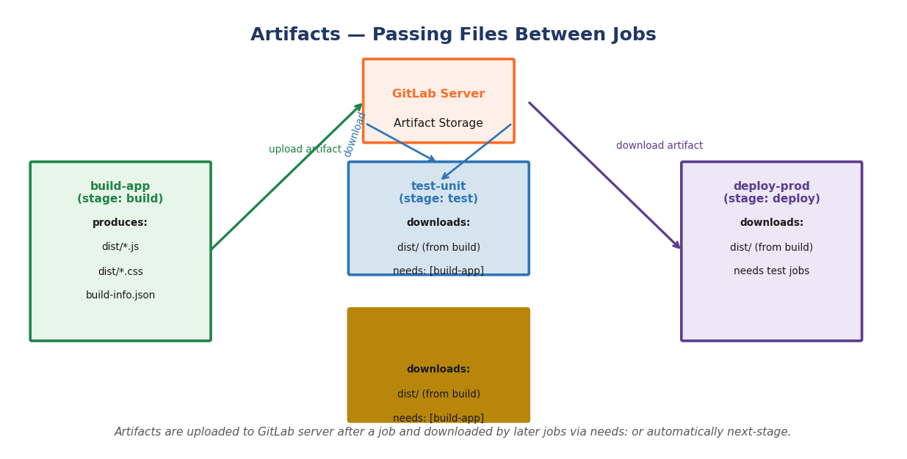

### Artifacts vs Cache

| Feature | Artifacts | Cache |
|---------|-----------|-------|
| **Purpose** | Pass files between jobs; download after run | Speed up jobs by reusing downloaded deps |
| **Scope** | Per-job; explicitly downloaded via `needs:` | Shared across jobs and pipeline runs |
| **Storage** | GitLab server | GitLab server (or distributed cache) |
| **Typical use** | Build output, test reports, compiled binaries | `node_modules/`, `.m2/`, pip wheels |
| **Expiry** | Set with `expire_in:` | Keyed by `key:` — invalidated explicitly |

### Artifacts — Passing Files Between Jobs

```yaml
build-app:
  stage: build
  script:
    - npm run build
  artifacts:
    name: "build-$CI_COMMIT_SHORT_SHA"   # Descriptive name in GitLab UI
    paths:
      - dist/                              # Upload this folder
    expire_in: 7 days                      # Auto-delete after 7 days
    when: always                           # Upload even if script: fails

test-unit:
  stage: test
  needs:
    - job: build-app
      artifacts: true         # Download dist/ artifact from build-app
  script:
    - cat dist/app.json       # dist/ is available here
    - npm test
```

### Report Artifacts — Native GitLab Integrations

GitLab parses certain artifact formats and displays them natively in pipelines and Merge Requests:

| Report Type | `artifacts.reports:` Key | GitLab Displays |
|-------------|--------------------------|-----------------|
| JUnit test results | `junit:` | Test counts and failures in MR widget and Tests tab |
| Code coverage | `coverage_report:` | Coverage % badge and MR diff annotation |
| Terraform plan | `terraform:` | Terraform plan summary directly in the MR |
| SAST findings | `sast:` | Security findings in the Security tab |
| Dependency scan | `dependency_scanning:` | Known CVEs in used packages |

```yaml
# Example: JUnit report artifact
test-with-report:
  stage: test
  script:
    - npm test -- --reporter junit --output reports/junit.xml
  artifacts:
    reports:
      junit: reports/junit.xml    # GitLab parses and shows in MR Tests tab
    paths:
      - reports/
    expire_in: 30 days
```

### Cache — Speeding Up Dependency Downloads

```yaml
# Cache node_modules/ — invalidate when lockfile changes
cache:
  key:
    files:
      - package-lock.json         # Cache key computed from this file's checksum
  paths:
    - node_modules/
  policy: pull-push               # Download at start, upload at end

# Per-branch caches
cache:
  key: "$CI_COMMIT_REF_SLUG"
  paths:
    - .m2/repository/             # Maven local repository
```

#### Key Takeaways
- **Artifacts** pass files *between jobs*. **Cache** speeds up *repeated runs*
- Use `artifacts.reports.junit` to get test results shown directly in Merge Requests
- Cache keys based on lockfile checksums invalidate automatically when dependencies change
- Set `expire_in:` on artifacts — keeps GitLab storage usage under control

---

## 08 — Terraform GitLab Pipeline

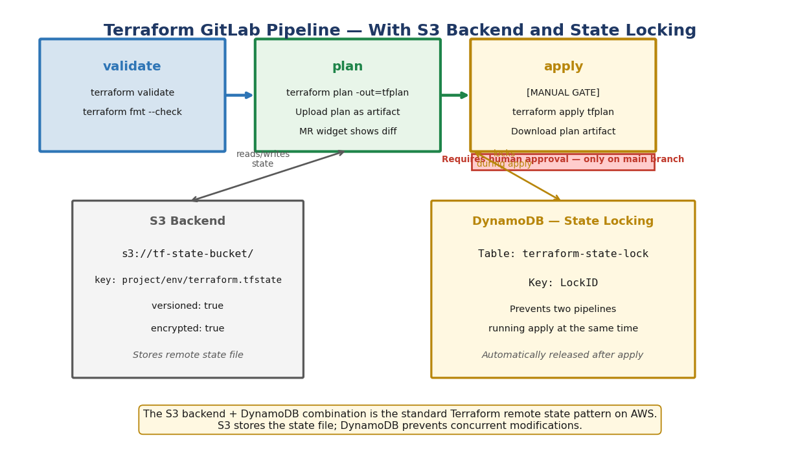

### Why a Dedicated Terraform Pipeline?

- Ensures every infrastructure change is **validated and reviewed** before apply
- The **plan artifact** shows exactly what will change — visible in the Merge Request
- **Manual gate** on apply prevents accidental infrastructure destruction
- **State locking** ensures only one apply runs at a time — prevents race conditions
- **Remote state** in S3 is shared across the team — not on a developer's laptop

### S3 Backend — Remote State Setup (one-time)

```bash
# Create the S3 bucket for state storage
aws s3 mb s3://my-company-tf-state --region eu-west-2

# Enable versioning — allows rollback to a previous state file
aws s3api put-bucket-versioning \
  --bucket my-company-tf-state \
  --versioning-configuration Status=Enabled

# Create DynamoDB table for state locking
aws dynamodb create-table \
  --table-name terraform-state-lock \
  --attribute-definitions AttributeName=LockID,AttributeType=S \
  --key-schema AttributeName=LockID,KeyType=HASH \
  --billing-mode PAY_PER_REQUEST \
  --region eu-west-2
```

### `backend.tf` — Keep Backend Config Out of the File

```hcl
# backend.tf
# Values are injected at runtime via CI/CD variables — never hardcoded.
terraform {
  backend "s3" {
    encrypt = true
    # Supplied via: terraform init -backend-config="bucket=..."
  }
}
```

### `main.tf` — Example Infrastructure

```hcl
terraform {
  required_version = ">= 1.6.0"
  required_providers {
    aws = { source = "hashicorp/aws", version = "~> 5.0" }
  }
}

variable "environment" {
  description = "dev / staging / prod"
  type        = string
}

resource "aws_s3_bucket" "example" {
  bucket = "my-app-assets-${var.environment}"
  tags   = { Environment = var.environment, ManagedBy = "Terraform" }
}
```

### `.gitlab-ci.yml` — The Full Pipeline

```yaml
image:
  name: hashicorp/terraform:1.7
  entrypoint: [""]    # Override entrypoint so GitLab can run any command

variables:
  TF_IN_AUTOMATION: "true"
  TF_CLI_ARGS_init: >-
    -backend-config="bucket=${TF_STATE_BUCKET}"
    -backend-config="key=${CI_PROJECT_NAME}/${TF_VAR_environment}/terraform.tfstate"
    -backend-config="region=${AWS_DEFAULT_REGION}"
    -backend-config="dynamodb_table=${TF_LOCK_TABLE}"
    -backend-config="encrypt=true"

stages:
  - validate
  - plan
  - apply

# YAML anchor — shared init steps reused across jobs
.init: &init
  before_script:
    - terraform --version
    - terraform init $TF_CLI_ARGS_init
  cache:
    key: "${CI_PROJECT_PATH}-${TF_VAR_environment}"
    paths: [.terraform/, .terraform.lock.hcl]

# ── Stage 1: validate ─────────────────────────────────────────────────────────
validate:
  stage: validate
  <<: *init
  script:
    - terraform validate        # Check syntax and internal consistency
    - terraform fmt --check     # Fail if code is not formatted
  rules:
    - if: '$CI_MERGE_REQUEST_ID'
    - if: '$CI_COMMIT_BRANCH == "main"'

# ── Stage 2: plan ─────────────────────────────────────────────────────────────
plan:
  stage: plan
  <<: *init
  script:
    - terraform plan -var="environment=${TF_VAR_environment}" -out=tfplan
    - terraform show -json tfplan > plan.json
  artifacts:
    paths: [tfplan, plan.json]       # tfplan = apply input; plan.json = MR widget
    expire_in: 7 days
    reports:
      terraform: plan.json           # Shows plan summary inside the Merge Request
  rules:
    - if: '$CI_MERGE_REQUEST_ID'
    - if: '$CI_COMMIT_BRANCH == "main"'

# ── Stage 3: apply ────────────────────────────────────────────────────────────
apply:
  stage: apply
  <<: *init
  script:
    - terraform apply -auto-approve tfplan   # Safe: applying a saved plan file
    - terraform output
  needs:
    - job: plan
      artifacts: true                        # Download tfplan binary
  environment:
    name: $TF_VAR_environment
  rules:
    - if: '$CI_COMMIT_BRANCH == "main"'
      when: manual                           # MUST click Play to apply
      allow_failure: false
```

### Required CI/CD Variables

| Variable | Description | Masked | Protected |
|----------|-------------|--------|-----------|
| `AWS_ACCESS_KEY_ID` | AWS access key | ✅ | ✅ |
| `AWS_SECRET_ACCESS_KEY` | AWS secret key | ✅ | ✅ |
| `AWS_DEFAULT_REGION` | e.g. `eu-west-2` | | |
| `TF_STATE_BUCKET` | S3 bucket name for state | | ✅ |
| `TF_LOCK_TABLE` | DynamoDB table for locking | | ✅ |
| `TF_VAR_environment` | `dev` / `staging` / `prod` | | |

> **Why `-auto-approve` is safe here:** we are applying a pre-saved binary plan file (`tfplan`), not planning and applying in one shot. The plan was reviewed and approved by a human in the MR. `-auto-approve` only skips the interactive `yes` prompt — which cannot be answered in CI anyway.

#### Key Takeaways
- Store Terraform state in S3 — **never** in git or on a local machine
- Use DynamoDB for state locking — prevents concurrent applies corrupting state
- The plan stage saves a binary plan; apply uses it — guarantees apply matches the reviewed plan exactly
- Apply is `when: manual` and restricted to `main` — no accidental production changes

---

## 09 — Java GitLab Pipeline

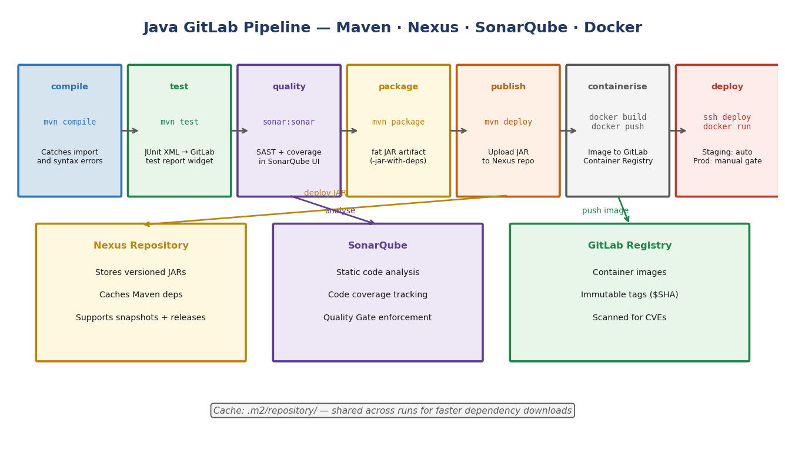

### Pipeline Overview

| Stage | Tool | What Happens | Output |
|-------|------|-------------|--------|
| `compile` | Maven | `mvn compile` — catches import/syntax errors early | `.class` files |
| `test` | Maven + JUnit 5 | `mvn test` — unit tests, publishes JUnit XML | Test results in MR |
| `quality` | SonarQube | SAST, coverage, quality gate enforcement | Findings in SonarQube |
| `package` | Maven | `mvn package` — fat JAR with all dependencies | `*-jar-with-deps.jar` |
| `publish` | Maven + Nexus | `mvn deploy` — uploads JAR to Nexus | Versioned JAR in Nexus |
| `containerise` | Docker | `docker build` + `push` | Image in GitLab Registry |
| `deploy` | SSH | `docker run` on target server | Running application |

### `pom.xml` — Key Sections

```xml
<project>
  <groupId>com.example.training</groupId>
  <artifactId>simple-java-app</artifactId>
  <version>${revision}</version>

  <properties>
    <!-- Use GitLab pipeline number as build version -->
    <revision>1.0.${CI_PIPELINE_IID}</revision>
    <java.version>17</java.version>
    <sonar.projectKey>simple-java-app</sonar.projectKey>
    <sonar.qualitygate.wait>true</sonar.qualitygate.wait>
  </properties>

  <dependencies>
    <dependency>
      <groupId>org.junit.jupiter</groupId>
      <artifactId>junit-jupiter</artifactId>
      <version>5.10.1</version>
      <scope>test</scope>
    </dependency>
  </dependencies>

  <!-- Nexus deployment target — credentials come from settings.xml -->
  <distributionManagement>
    <repository>
      <id>nexus-releases</id>
      <url>${env.NEXUS_URL}/repository/maven-releases/</url>
    </repository>
  </distributionManagement>
</project>
```

### `settings.xml` — Nexus Authentication

Store the **contents** of this file as a GitLab CI/CD **File** type variable named `MAVEN_SETTINGS_XML`. GitLab writes it to disk during the pipeline; Maven reads it via `-s $MAVEN_SETTINGS_XML`.

```xml
<settings>
  <servers>
    <server>
      <id>nexus-releases</id>
      <username>${env.NEXUS_USERNAME}</username>
      <password>${env.NEXUS_PASSWORD}</password>
    </server>
    <server>
      <id>nexus-snapshots</id>
      <username>${env.NEXUS_USERNAME}</username>
      <password>${env.NEXUS_PASSWORD}</password>
    </server>
  </servers>
  <mirrors>
    <!-- Route all Maven downloads through Nexus -->
    <mirror>
      <id>nexus-central</id>
      <mirrorOf>central</mirrorOf>
      <url>${env.NEXUS_URL}/repository/maven-central/</url>
    </mirror>
  </mirrors>
</settings>
```

### `Dockerfile` — Multi-Stage Build

```dockerfile
# Stage 1: build the fat JAR in a Maven image
FROM maven:3.9-eclipse-temurin-17 AS build
WORKDIR /app
COPY pom.xml .
RUN mvn dependency:go-offline -q      # Cache layer — only re-runs if pom.xml changes
COPY src/ src/
RUN mvn package -DskipTests -q

# Stage 2: run in a minimal JRE image (no Maven, no source code)
FROM eclipse-temurin:17-jre-alpine
WORKDIR /app
COPY --from=build /app/target/*-jar-with-dependencies.jar app.jar
EXPOSE 8080
ENTRYPOINT ["java", "-jar", "app.jar"]
```

> Multi-stage builds produce **much smaller images** — the runtime image doesn't contain Maven, source files, or any build tooling.

### `.gitlab-ci.yml` — The Full Pipeline

```yaml
image: maven:3.9-eclipse-temurin-17

variables:
  # Store .m2 inside the project dir so it is cached correctly
  MAVEN_OPTS: "-Dmaven.repo.local=$CI_PROJECT_DIR/.m2/repository"
  MAVEN_CLI_OPTS: "--batch-mode --errors --fail-at-end --show-version"

stages:
  - compile
  - test
  - quality
  - package
  - publish
  - containerise
  - deploy

# Cache the local Maven repository — saves minutes on every run
cache:
  key:
    files:
      - pom.xml                    # Invalidate cache when dependencies change
  paths:
    - .m2/repository/

# ── Stage 1: compile ──────────────────────────────────────────────────────────
compile:
  stage: compile
  script:
    - mvn $MAVEN_CLI_OPTS compile
  artifacts:
    paths: [target/classes/]
    expire_in: 1 hour

# ── Stage 2: test ─────────────────────────────────────────────────────────────
unit-test:
  stage: test
  script:
    - mvn $MAVEN_CLI_OPTS test
  artifacts:
    reports:
      junit: target/surefire-reports/TEST-*.xml   # Shows test results in MR
    paths: [target/surefire-reports/]
    expire_in: 30 days
    when: always    # Upload test report even if tests fail

# ── Stage 3: quality ──────────────────────────────────────────────────────────
sonarqube-analysis:
  stage: quality
  script:
    - mvn $MAVEN_CLI_OPTS verify sonar:sonar
        -Dsonar.projectKey=$CI_PROJECT_NAME
        -Dsonar.host.url=$SONAR_HOST_URL
        -Dsonar.token=$SONAR_TOKEN
  allow_failure: true          # Start non-blocking; tighten quality gate over time
  rules:
    - if: '$CI_COMMIT_BRANCH == "main"'
    - if: '$CI_MERGE_REQUEST_ID'

# ── Stage 4: package ──────────────────────────────────────────────────────────
package-jar:
  stage: package
  script:
    - mvn $MAVEN_CLI_OPTS package -DskipTests
    - echo "=== Built artifacts ===" && ls -lh target/*.jar
  artifacts:
    name: "$CI_PROJECT_NAME-$CI_COMMIT_SHORT_SHA"
    paths: [target/*.jar]
    exclude: [target/original-*.jar]   # Exclude the non-fat JAR
    expire_in: 30 days

# ── Stage 5: publish ──────────────────────────────────────────────────────────
publish-to-nexus:
  stage: publish
  script:
    - mvn $MAVEN_CLI_OPTS deploy -DskipTests -s $MAVEN_SETTINGS_XML
  needs:
    - job: package-jar
      artifacts: true
    - job: unit-test
      artifacts: false
  rules:
    - if: '$CI_COMMIT_BRANCH == "main"'

# ── Stage 6: containerise ─────────────────────────────────────────────────────
docker-build-push:
  stage: containerise
  image: docker:24-cli
  services:
    - docker:24-dind                      # Docker-in-Docker sidecar
  variables:
    DOCKER_TLS_CERTDIR: "/certs"
    IMAGE_TAG: $CI_REGISTRY_IMAGE:$CI_COMMIT_SHORT_SHA
    IMAGE_LATEST: $CI_REGISTRY_IMAGE:latest
  script:
    - docker login -u $CI_REGISTRY_USER -p $CI_REGISTRY_PASSWORD $CI_REGISTRY
    - docker build -t $IMAGE_TAG -t $IMAGE_LATEST .
    - docker push $IMAGE_TAG
    - docker push $IMAGE_LATEST
  needs:
    - job: package-jar
      artifacts: true
  rules:
    - if: '$CI_COMMIT_BRANCH == "main"'

# ── Stage 7: deploy ───────────────────────────────────────────────────────────
deploy-staging:
  stage: deploy
  image: alpine:3.19
  before_script:
    - apk add --no-cache openssh-client
    - eval $(ssh-agent -s)
    - echo "$DEPLOY_SSH_KEY" | tr -d '\r' | ssh-add -
    - mkdir -p ~/.ssh && chmod 700 ~/.ssh
    - ssh-keyscan -H $DEPLOY_HOST >> ~/.ssh/known_hosts
  script:
    - ssh deploy@$DEPLOY_HOST "
        docker pull $CI_REGISTRY_IMAGE:$CI_COMMIT_SHORT_SHA &&
        docker stop app-staging 2>/dev/null || true &&
        docker rm   app-staging 2>/dev/null || true &&
        docker run -d --name app-staging --restart unless-stopped
          -p 8080:8080
          $CI_REGISTRY_IMAGE:$CI_COMMIT_SHORT_SHA"
  environment:
    name: staging
    url: http://$DEPLOY_HOST:8080
  needs:
    - job: docker-build-push
  rules:
    - if: '$CI_COMMIT_BRANCH == "main"'

deploy-production:
  stage: deploy
  image: alpine:3.19
  before_script:
    - apk add --no-cache openssh-client
    - eval $(ssh-agent -s)
    - echo "$DEPLOY_SSH_KEY" | tr -d '\r' | ssh-add -
    - mkdir -p ~/.ssh && chmod 700 ~/.ssh
    - ssh-keyscan -H $DEPLOY_HOST >> ~/.ssh/known_hosts
  script:
    - ssh deploy@$DEPLOY_HOST "
        docker pull $CI_REGISTRY_IMAGE:$CI_COMMIT_SHORT_SHA &&
        docker stop app-production 2>/dev/null || true &&
        docker rm   app-production 2>/dev/null || true &&
        docker run -d --name app-production --restart unless-stopped
          -p 80:8080
          $CI_REGISTRY_IMAGE:$CI_COMMIT_SHORT_SHA"
  environment:
    name: production
    url: http://$DEPLOY_HOST
  needs:
    - job: docker-build-push
  rules:
    - if: '$CI_COMMIT_TAG'
      when: manual    # Tag push + human approval required for production
```

### Required CI/CD Variables

| Variable | Description | Masked | Protected |
|----------|-------------|--------|-----------|
| `NEXUS_URL` | e.g. `https://nexus.mycompany.com` | | |
| `NEXUS_USERNAME` | Nexus deployment user | | |
| `NEXUS_PASSWORD` | Nexus deployment password | ✅ | ✅ |
| `SONAR_HOST_URL` | e.g. `https://sonarqube.mycompany.com` | | |
| `SONAR_TOKEN` | SonarQube project token | ✅ | ✅ |
| `DEPLOY_HOST` | SSH hostname of deployment server | | ✅ |
| `DEPLOY_SSH_KEY` | Private SSH key (PEM format) | ✅ | ✅ |
| `MAVEN_SETTINGS_XML` | File-type variable — settings.xml contents | | |

#### Key Takeaways
- Use Docker **multi-stage builds** — keep production images small and free of build tooling
- Store Nexus credentials in a GitLab **File variable** for `settings.xml` — never hardcode
- Tag Docker images with `$CI_COMMIT_SHORT_SHA` — immutable, uniquely identifies the exact build
- Cache `.m2/repository/` keyed on `pom.xml` — saves minutes on every pipeline run
- Start SonarQube with `allow_failure: true` — adopt quality gates gradually as the team matures

---

## Quick Reference

### Common `rules:` Patterns

```yaml
# Run only on main
rules:
  - if: '$CI_COMMIT_BRANCH == "main"'

# Run on main OR merge requests
rules:
  - if: '$CI_COMMIT_BRANCH == "main"'
  - if: '$CI_MERGE_REQUEST_ID'

# Run only when a tag is pushed
rules:
  - if: '$CI_COMMIT_TAG'

# Run manually on tags only
rules:
  - if: '$CI_COMMIT_TAG'
    when: manual

# Skip on main, run everywhere else
rules:
  - if: '$CI_COMMIT_BRANCH == "main"'
    when: never
  - when: always

# Run only when specific file changes
rules:
  - changes:
      - src/**/*.java
      - pom.xml
```

### Common Pipeline Patterns

```yaml
# ── Pattern: Docker build and push ────────────────────────────────────────────
docker-build:
  image: docker:24-cli
  services: [docker:24-dind]
  variables:
    DOCKER_TLS_CERTDIR: "/certs"
  script:
    - docker login -u $CI_REGISTRY_USER -p $CI_REGISTRY_PASSWORD $CI_REGISTRY
    - docker build -t $CI_REGISTRY_IMAGE:$CI_COMMIT_SHORT_SHA .
    - docker push $CI_REGISTRY_IMAGE:$CI_COMMIT_SHORT_SHA

# ── Pattern: SSH deploy ────────────────────────────────────────────────────────
deploy:
  before_script:
    - apk add --no-cache openssh-client
    - eval $(ssh-agent -s)
    - echo "$DEPLOY_SSH_KEY" | tr -d '\r' | ssh-add -
    - ssh-keyscan -H $DEPLOY_HOST >> ~/.ssh/known_hosts
  script:
    - ssh user@$DEPLOY_HOST "docker pull $IMAGE && docker restart app"

# ── Pattern: Slack notification on failure ────────────────────────────────────
notify-failure:
  stage: .post
  script:
    - |
      curl -X POST $SLACK_WEBHOOK -H 'Content-type: application/json' \
        -d "{\"text\":\"Pipeline FAILED on $CI_COMMIT_REF_NAME by $GITLAB_USER_LOGIN\"}"
  when: on_failure
```

---

## Repository Structure

```
gitlab-training/
├── README.md                          ← You are here
├── 00-introduction/
│   └── README.md                      GitLab overview and architecture
├── 01-basic-pipeline/
│   ├── README.md
│   └── .gitlab-ci.yml                 Simplest working 3-stage pipeline
├── 02-jobs-deep-dive/
│   ├── README.md
│   └── .gitlab-ci.yml                 before_script, after_script, rules, needs, manual gate
├── 03-variables/
│   ├── README.md
│   └── .gitlab-ci.yml                 Predefined vars, project vars, conditional rules
├── 04-artifacts/
│   ├── README.md
│   └── .gitlab-ci.yml                 Artifacts, JUnit reports, cache with lockfile key
├── 05-terraform-pipeline/
│   ├── README.md
│   ├── .gitlab-ci.yml                 validate → plan (MR widget) → manual apply
│   ├── backend.tf                     S3 backend configuration
│   └── main.tf                        Example Terraform resource
├── 06-java-pipeline/
│   ├── README.md
│   ├── .gitlab-ci.yml                 7-stage full pipeline
│   ├── pom.xml                        Maven with JUnit 5, SonarQube, fat-JAR, Nexus
│   ├── settings.xml                   Nexus auth (designed to be a File variable)
│   ├── Dockerfile                     Multi-stage build → slim JRE runtime image
│   └── src/
│       ├── main/java/com/example/training/
│       │   ├── Main.java
│       │   └── Calculator.java
│       └── test/java/com/example/training/
│           └── CalculatorTest.java
├── 07-include/
│   ├── README.md
│   ├── .gitlab-ci.yml                 Root pipeline using all four include: types
│   ├── .gitlab/templates/
│   │   ├── build.yml                  Local template — build job with hidden base
│   │   ├── test.yml                   Local template — unit + integration tests
│   │   └── deploy.yml                 Local template — staging + prod deploy jobs
│   └── ci-templates/                  Simulates a shared org-wide template repo
│       ├── build/docker.yml           Reusable Docker build + push
│       ├── build/maven.yml            Reusable Maven compile + package
│       ├── test/junit.yml             Reusable Maven test + JUnit report
│       ├── test/lint.yml              Reusable YAML + Dockerfile linting
│       ├── deploy/ssh-deploy.yml      Base SSH deploy (extend this)
│       ├── security/sast.yml          SAST wrapper with org defaults
│       └── notify/slack.yml           Slack success + failure notifications
└── images/                            Diagrams used in this README
```

---

*Software Engineering Training — GitLab CI/CD from Basics to Production*

---

## 10 — include: Composing Pipelines from Reusable Templates

Without `include:`, every project copy-pastes the same Docker build steps, the same SSH setup, the same Slack notification block. One security fix means editing 30 repositories. `include:` solves this — define once, import everywhere.

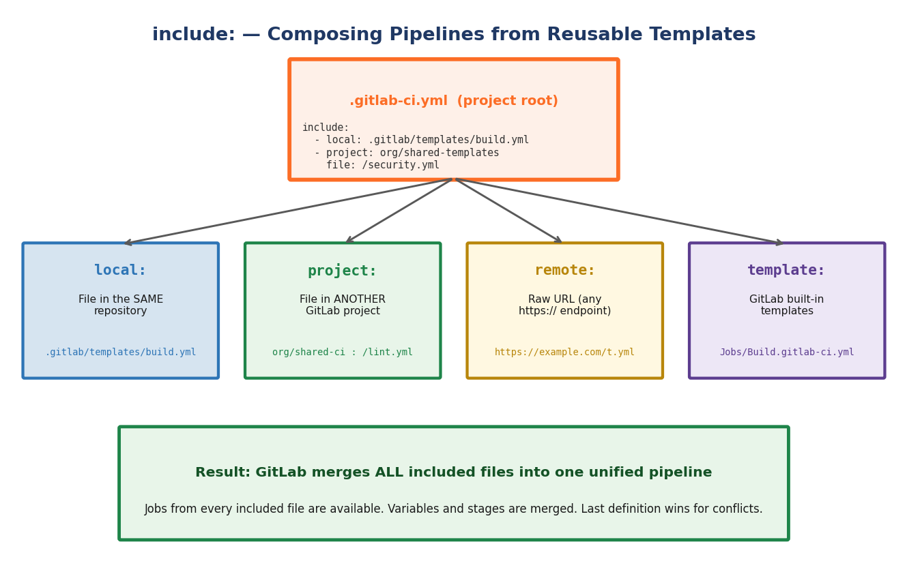

### The Four include: Types

```yaml
include:
  # 1. local: — a file in the SAME repository
  - local: .gitlab/templates/build.yml

  # 2. project: — a file in ANOTHER GitLab repository
  - project: org/shared-ci-templates
    ref: main                          # pin to branch, tag, or commit SHA
    file: /ci-templates/deploy/ssh-deploy.yml

  # 3. remote: — any publicly accessible HTTPS URL
  - remote: https://raw.githubusercontent.com/org/templates/main/ci/lint.yml

  # 4. template: — GitLab's own built-in template library
  - template: Security/SAST.gitlab-ci.yml
```

| Type | Source | When to Use |
|------|--------|-------------|
| `local:` | Same repo | Project-specific reusable blocks; tight coupling is fine |
| `project:` | Another GitLab repo | Organisation-wide standards; single source of truth |
| `remote:` | Any HTTPS URL | Third-party templates; internal CDN |
| `template:` | GitLab's built-in library | Official GitLab-managed features (SAST, Auto DevOps, etc.) |

### How GitLab Merges Included Files

When your pipeline runs, GitLab fetches every included file and **deep-merges** them into one unified configuration:

```
.gitlab-ci.yml
   + .gitlab/templates/build.yml
   + .gitlab/templates/test.yml
   + org/shared-ci-templates → /ci-templates/notify/slack.yml
   + GitLab built-in → Security/SAST.gitlab-ci.yml
   ─────────────────────────────────────────────────────
   = One merged pipeline with all jobs, stages, and variables
```

Rules for merging:
- `stages:` from the root `.gitlab-ci.yml` takes precedence
- **Last definition wins** when the same key appears in multiple files
- Jobs with the same name are merged — the root file's keys override the included file's keys
- `variables:` blocks are merged; root file wins on conflicts

### Template Library Structure

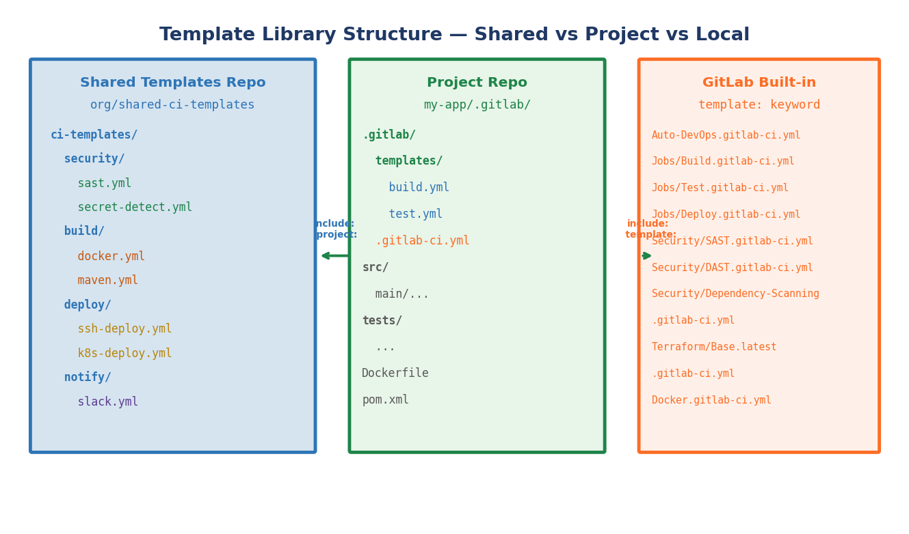

The recommended structure for a shared-templates repository:

```
org/shared-ci-templates/          ← separate GitLab repository
  ci-templates/
    build/
      docker.yml                  Reusable Docker build + push job
      maven.yml                   Reusable Maven compile + package job
    test/
      junit.yml                   Reusable test + JUnit report job
      lint.yml                    Reusable linting job (allow_failure: true)
    deploy/
      ssh-deploy.yml              Base SSH deploy job (extend this)
    security/
      sast.yml                    Wraps GitLab SAST template with org defaults
    notify/
      slack.yml                   On-success and on-failure Slack notifications
```

A project that needs Docker builds, Maven tests, and Slack notifications:

```yaml
# project/.gitlab-ci.yml — just 10 lines instead of 150

stages: [build, test, deploy, .post]

include:
  - project: org/shared-ci-templates
    ref: main
    file:
      - /ci-templates/build/docker.yml
      - /ci-templates/test/junit.yml
      - /ci-templates/notify/slack.yml
  - local: .gitlab/templates/deploy.yml
```

### Hidden Jobs — The Template Pattern

Any job whose name starts with a dot (`.`) is a **hidden job** — GitLab ignores it during execution but other jobs can `extends:` from it. This is the core pattern for shared templates.

```yaml
# In a shared template file:
.ssh-deploy-base:           # hidden — never executed directly
  image: alpine:3.19
  before_script:
    - apk add --no-cache openssh-client
    - eval $(ssh-agent -s)
    - echo "$DEPLOY_SSH_KEY" | tr -d '\r' | ssh-add -
    - mkdir -p ~/.ssh && chmod 700 ~/.ssh
    - ssh-keyscan -H "$DEPLOY_HOST" >> ~/.ssh/known_hosts
```

```yaml
# In the project's .gitlab-ci.yml (or another template file):
deploy-staging:
  extends: .ssh-deploy-base     # inherits ALL keys from .ssh-deploy-base
  stage: deploy
  script:
    - ssh deploy@$DEPLOY_HOST "docker restart app-staging"
  environment:
    name: staging
```

### `extends:` vs YAML Anchors — Which to Use

Both reduce duplication, but they work differently:

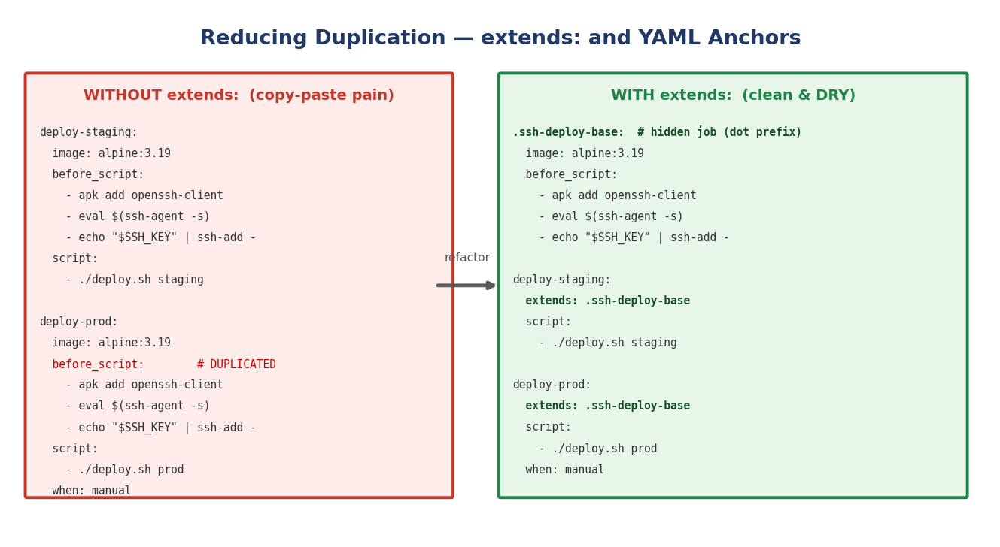

| Feature | `extends:` | YAML Anchors (`&` / `*`) |
|---------|-----------|--------------------------|
| Works across `include:`d files | ✅ Yes | ❌ No — anchors only work in the same file |
| Deep merge | ✅ Keys are merged | ❌ Full replacement |
| GitLab UI visibility | ✅ Shown in "Full config" | ✅ Shown expanded |
| Best for | Cross-file template inheritance | In-file repetition |

```yaml
# YAML anchors — work within a single file
.deploy-defaults: &deploy-defaults
  image: alpine:3.19
  when: manual

deploy-staging:
  <<: *deploy-defaults          # copies ALL keys (full replacement, not merge)
  script: ./deploy.sh staging

# extends: — works across included files; merges deeply
deploy-staging:
  extends: .ssh-deploy-base     # merges key by key — can override individual keys
  script: ./deploy.sh staging   # only this key is overridden; all others inherited
```

### Pinning Templates to a Specific Version

When including from another project, always pin to a **tag** or **commit SHA** — not just `main`. This prevents upstream changes from breaking your pipelines unexpectedly.

```yaml
include:
  # BAD — always uses latest, upstream can break you
  - project: org/shared-ci-templates
    ref: main
    file: /ci-templates/build/docker.yml

  # GOOD — pinned to a specific release tag
  - project: org/shared-ci-templates
    ref: v2.3.1
    file: /ci-templates/build/docker.yml

  # ALSO GOOD — pinned to an immutable commit SHA
  - project: org/shared-ci-templates
    ref: a1b2c3d4e5f6
    file: /ci-templates/build/docker.yml
```

### Complete Example — Root Pipeline Using All Four Types

```yaml
# .gitlab-ci.yml

stages:
  - build
  - test
  - quality
  - deploy
  - .post          # GitLab built-in stage — runs after everything else

variables:
  APP_VERSION: "2.1.0"

include:
  # ── 1. local: — project-specific templates ──────────────────────────────────
  - local: .gitlab/templates/build.yml
  - local: .gitlab/templates/test.yml

  # ── 2. project: — org-wide shared templates (pinned to a release) ───────────
  - project: org/shared-ci-templates
    ref: v2.3.1
    file:
      - /ci-templates/build/docker.yml
      - /ci-templates/deploy/ssh-deploy.yml
      - /ci-templates/notify/slack.yml

  # ── 3. remote: — third-party template ───────────────────────────────────────
  - remote: https://example.com/ci-templates/terraform-lint.yml

  # ── 4. template: — GitLab built-in SAST scanner ─────────────────────────────
  - template: Security/SAST.gitlab-ci.yml

# Only define what is UNIQUE to this project.
# Everything else comes from the included templates above.

# Override one key from the included docker build template
docker-build-push:
  variables:
    DOCKER_BUILD_ARGS: "--build-arg APP_VERSION=$APP_VERSION"  # add a build arg

# Add a project-specific job not in any template
database-migration:
  stage: deploy
  image: flyway/flyway:10
  script:
    - flyway -url=$DB_URL -user=$DB_USER -password=$DB_PASSWORD migrate
  needs: [deploy-staging]
  rules:
    - if: '$CI_COMMIT_BRANCH == "main"'
```

### Built-in GitLab Templates Worth Knowing

```yaml
# Security scanning
- template: Security/SAST.gitlab-ci.yml
- template: Security/DAST.gitlab-ci.yml
- template: Security/Dependency-Scanning.gitlab-ci.yml
- template: Security/Secret-Detection.gitlab-ci.yml
- template: Security/Container-Scanning.gitlab-ci.yml

# Deployment
- template: Jobs/Deploy.gitlab-ci.yml
- template: Terraform/Base.latest.gitlab-ci.yml

# Code quality
- template: Code-Quality.gitlab-ci.yml

# Full auto-everything (not recommended for complex projects)
- template: Auto-DevOps.gitlab-ci.yml
```

> Browse all built-in templates at: `https://gitlab.com/gitlab-org/gitlab/-/tree/master/lib/gitlab/ci/templates`

#### Key Takeaways
- `include:` pulls in YAML from local files, other repos, URLs, or GitLab's template library
- GitLab **deep-merges** all included files — root `.gitlab-ci.yml` wins on conflicts
- Jobs starting with `.` are **hidden** — reusable bases for `extends:`, never executed directly
- Use `extends:` over YAML anchors when sharing across included files — anchors are file-local
- Always **pin** `project:` includes to a tag or SHA — never rely on `main` for stability
- Keep root `.gitlab-ci.yml` minimal — just `stages:`, `variables:`, `include:`, and project-unique jobs
